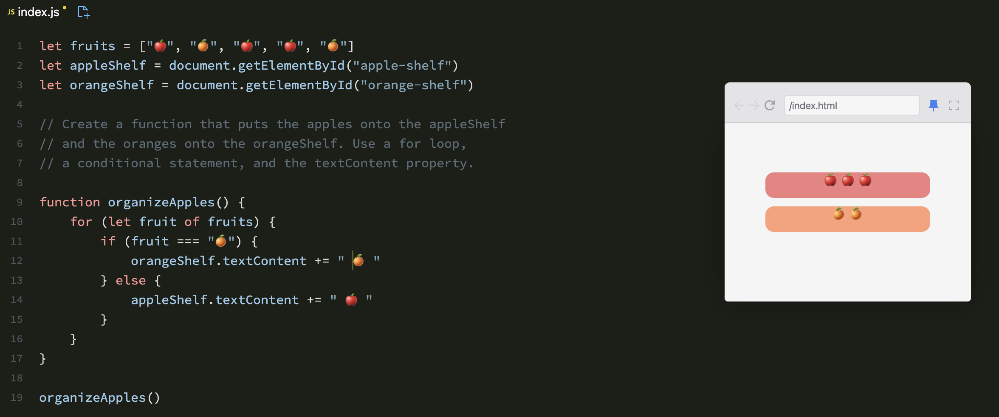

# Loops in JavaScript

Loops are used in JavaScript to perform repeated tasks based on a condition. Conditions typically return true or false. A loop will continue running until the defined condition returns false.

Practice File : [loops.js](https://codepen.io/DE-LA-ROSA-VAZQUEZ-JOSUE/pen/emOYxvR)

## Types of Loops

### 1. `for` Loop
The `for` loop is the most commonly used loop. It has three parts: initialization, condition, and increment/decrement.

```javascript
for (let i = 0; i < 5; i++) {
    console.log(i);
}
```

### 2. `while` Loop
The `while` loop runs as long as the specified condition is true.

```javascript
let i = 0;
while (i < 5) {
    console.log(i);
    i++;
}
```

### 3. `do...while` Loop
The `do...while` loop is similar to the `while` loop, but it will always execute the block of code once before checking the condition.

```javascript
let i = 0;
do {
    console.log(i);
    i++;
} while (i < 5);
```

### 4. `for...in` Loop
The `for...in` loop is used to iterate over the properties of an object.

```javascript
const obj = {a: 1, b: 2, c: 3};
for (let key in obj) {
    console.log(key + ': ' + obj[key]);
}
```

### 5. `for...of` Loop
The `for...of` loop is used to iterate over iterable objects like arrays, strings, etc.

```javascript
const arr = [1, 2, 3, 4, 5];
for (let value of arr) {
    console.log(value);
}
```
Example:


