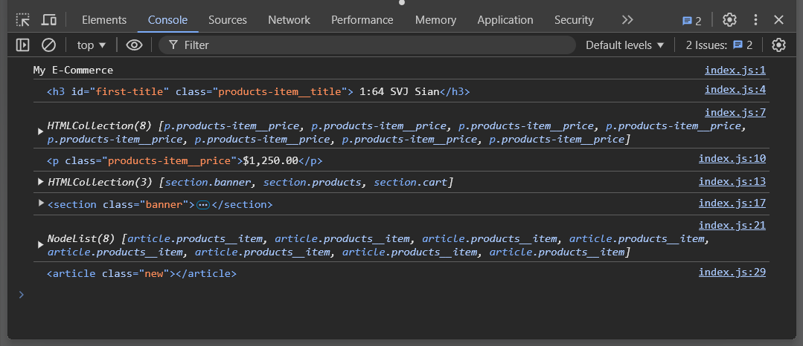

# DOM Methods in JS

To interact with the DOM, we use JavaScript. JavaScript provides us with a number of methods to interact with the DOM. These methods are used to manipulate the DOM elements, their attributes, and their content.

But, first you need to know how to add javascript to your HTML file. You can add javascript to your HTML file in two ways: 

1. Inline JavaScript
2. External JavaScript

### Inline JavaScript

Inline JavaScript is when you write your JavaScript code directly in your HTML file. You can add JavaScript code inside the `<script>` tag in your HTML file. Here is an example of inline JavaScript:

```html
<!DOCTYPE html>
<html>
<head>
    <title>Inline JavaScript</title>
</head>
<body>
    <h1>Inline JavaScript</h1>
    <p id="demo"></p>
    <script>
        document.getElementById("demo").innerHTML = "Hello, World!";
    </script>
</body>
</html>
```

In the above example, we have added a `<script>` tag inside the `<body>` tag. The JavaScript code inside the `<script>` tag is used to change the content of the `<p>` tag with the id `demo`.

### External JavaScript

External JavaScript is when you write your JavaScript code in a separate file and link it to your HTML file. You can link your JavaScript file to your HTML file using the `<script>` tag. Here is an example of external JavaScript:

```html
<!DOCTYPE html>
<html>
<head>
    <title>External JavaScript</title>
    <script src="script.js"></script>
</head>
<body>
    <h1>External JavaScript</h1>
    <p id="demo"></p>
</body>
</html>
```

In the above example, we have linked an external JavaScript file `script.js` to our HTML file. The JavaScript code in the `script.js` file is used to change the content of the `<p>` tag with the id `demo`.

Also to assure the script is loaded after the DOM is loaded, you can add the `defer` attribute to the script tag:

```html
<script src="script.js" defer></script>
```
Other wise you can add the script tag at the end of the body tag.

Now that you know how to add JavaScript to your HTML file, let's look at some of the most commonly used DOM methods in JavaScript.

### Commonly Used DOM Methods

1. `document.getElementById()`: This method is used to get an element by its id. It returns the element with the specified id.

2. `document.getElementsByClassName()`: This method is used to get elements by their class name. It returns a collection of elements with the specified class name.

3. `document.getElementsByTagName()`: This method is used to get elements by their tag name. It returns a collection of elements with the specified tag name.

4. `document.querySelector()`: This method is used to get the first element that matches a specified CSS selector. It returns the first element that matches the specified selector.

5. `document.querySelectorAll()`: This method is used to get all elements that match a specified CSS selector. It returns a collection of elements that match the specified selector.

6. `element.innerHTML`: This property is used to get or set the HTML content of an element.

7. `element.textContent`: This property is used to get or set the text content of an element.

8. `element.setAttribute()`: This method is used to set the value of an attribute on an element.

9. `element.getAttribute()`: This method is used to get the value of an attribute on an element.

10. `element.addEventListener()`: This method is used to add an event listener to an element.

These are some of the most commonly used DOM methods in JavaScript. There are many more DOM methods that you can use to interact with the DOM. You can refer to the [MDN Web Docs](https://developer.mozilla.org/en-US/docs/Web/API/Document_Object_Model) for more information on DOM methods in JavaScript.

[Practical Examples Here](documents/applied-DOM/js/index.js)

