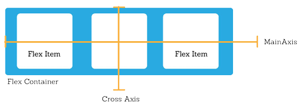
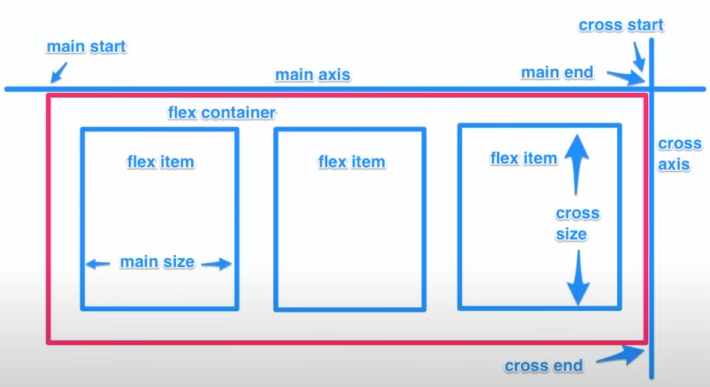

# Flexbox in HTML and CSS

## Introduction
Flexbox is a layout model in CSS that allows you to design complex layouts with ease. It provides a more efficient way to lay out, align, and distribute space among items in a container.

## Basic Concepts

Watch this [video](https://www.youtube.com/watch?v=JJSoEo8JSnc) to understand the basic concepts of Flexbox.

### Flex Container
To create a flexbox layout, you need a flex container. This is done by setting the `display` property to `flex` or `inline-flex`.



```html
<div class="flex-container">
    <div class="flex-item">Item 1</div>
    <div class="flex-item">Item 2</div>
    <div class="flex-item">Item 3</div>
</div>
```

```css
.flex-container {
    display: flex;
}
```

### Flex Items
The direct children of a flex container automatically become flex items.

## Flexbox Properties

### Container Properties
- `flex-direction`: Defines the direction of the flex items.
- `justify-content`: Aligns the flex items along the main axis.
- `align-items`: Aligns the flex items along the cross axis.
- `flex-wrap`: Specifies whether the flex items should wrap or not.



### Item Properties
- `order`: Controls the order of the flex items.
- `flex-grow`: Defines the ability for a flex item to grow if necessary.
- `flex-shrink`: Defines the ability for a flex item to shrink if necessary.
- `flex-basis`: Defines the default size of an element before the remaining space is distributed.

## Example

```html
<!DOCTYPE html>
<html lang="en">
<head>
    <meta charset="UTF-8">
    <meta name="viewport" content="width=device-width, initial-scale=1.0">
    <title>Flexbox Example</title>
    <style>
        .flex-container {
            display: flex;
            flex-direction: row;
            justify-content: space-around;
            align-items: center;
            height: 100vh;
        }
        .flex-item {
            background-color: #4CAF50;
            color: white;
            padding: 20px;
            margin: 10px;
            text-align: center;
        }
    </style>
</head>
<body>
    <div class="flex-container">
        <div class="flex-item">Item 1</div>
        <div class="flex-item">Item 2</div>
        <div class="flex-item">Item 3</div>
    </div>
</body>
</html>
```

## Conclusion
Flexbox is a powerful tool for creating responsive layouts. By understanding its properties and how they interact, you can create flexible and efficient designs.

For more information, refer to the [MDN Web Docs on Flexbox](https://developer.mozilla.org/en-US/docs/Web/CSS/CSS_Flexible_Box_Layout/Basic_Concepts_of_Flexbox).