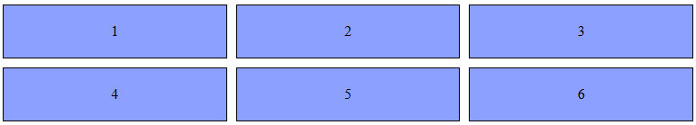

# HTML and CSS Grid

## Introduction
CSS Grid Layout is a two-dimensional layout system for the web. It lets you layout items in rows and columns, making it easier to design web pages without using floats and positioning.

*Watch this video to learn more about CSS Grid Layout:*

[](https://www.youtube.com/watch?v=7kVeCqQCxlk)

The web real [Example](/Stage-6/dcuments/grid/) of Grid Layout.

## Basic HTML Structure
```html
<!DOCTYPE html>
<html lang="en">
<head>
    <meta charset="UTF-8">
    <meta name="viewport" content="width=device-width, initial-scale=1.0">
    <title>CSS Grid Example</title>
    <link rel="stylesheet" href="styles.css">
</head>
<body>
    <div class="grid-container">
        <div class="grid-item">1</div>
        <div class="grid-item">2</div>
        <div class="grid-item">3</div>
        <div class="grid-item">4</div>
        <div class="grid-item">5</div>
        <div class="grid-item">6</div>
    </div>
</body>
</html>
```

## Basic CSS Grid
```css
.grid-container {
    display: grid;
    grid-template-columns: repeat(3, 1fr);
    gap: 10px;
}

.grid-item {
    background-color: #8ca0ff;
    border: 1px solid #000;
    padding: 20px;
    text-align: center;
}
```



## Explanation
- **grid-template-columns**: Defines the number of columns in the grid and their width. `repeat(3, 1fr)` creates three columns of equal width.
- **gap**: Sets the spacing between grid items.
- **grid-item**: Styles for individual grid items.

## Resources
- [MDN Web Docs: CSS Grid Layout](https://developer.mozilla.org/en-US/docs/Web/CSS/CSS_Grid_Layout)
- [CSS-Tricks: A Complete Guide to Grid](https://css-tricks.com/snippets/css/complete-guide-grid/)


CSS Grid Layout is a powerful tool for creating complex web layouts. By mastering it, you can create responsive and flexible designs with ease.