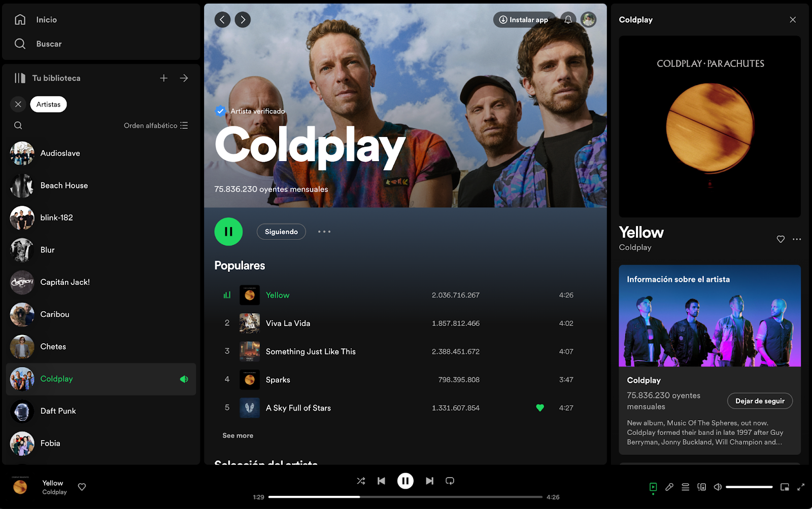

Utilizando HTML y Sass, los alumnos se enfocarán en imitar la interfaz de usuario de Spotify, prestando especial atención a la replicación de su diseño distintivo. Al aplicar técnicas avanzadas como imports, el operador "&", funciones personalizadas y media queries con mixins en Sass, los estudiantes aprenderán a traducir un diseño de alta fidelidad a código, optimizando la estructura.

### Antes de comenzar

- Familiarízate con la interfaz de usuario de Spotify para entender los elementos que se replicarán. Los iconos, colores y tipografía no tiene que ser la misma, pero sí acercarse lo más posible a los elementos originales. 

- Ten listos todos los recursos como textos, iconos, logos, imágenes, etc antes de comenzar. Puedes encontrar iconos en este sitio https://www.freepik.es/iconos , es importante destacar que estos iconos no tienen licencia comercial por lo que se limitan a ser usados en proyectos que no tengan un uso comercial.

- Asegúrate de tener una comprensión básica de cómo funcionan los imports en Sass y cómo pueden ayudar a organizar mejor tu código.

- Revisa la sintaxis de Sass para la creación de funciones y el uso del operador "&".

- Comprende cómo las media queries y los mixins pueden trabajar juntos para crear un diseño responsivo.

### Paso a paso

- **Estructura con Imports:** Comienza por dividir tu hoja de estilo en módulos lógicos (por ejemplo, variables, mixins, base, layout, componentes) y utiliza @import para incluirlos en un archivo principal. Esto mejora la organización y hace que el código sea más mantenible.

- **Refinamiento con el Operador "&":** Utiliza el operador "&" para anidar selectores de manera eficiente y para referenciar el selector padre, lo que es especialmente útil para estados de elementos como :hover, :active, o para modificar elementos cuando se encuentren dentro de una clase específica.

- **Creación de Funciones en Sass:** Define funciones que realicen cálculos o que ayuden a manejar colores y otros valores que puedan necesitar lógica aplicada. Por ejemplo, una función para crear una paleta de colores basada en un color principal o para calcular dimensiones proporcionales.

- **Media Queries con Mixins:** Diseña mixins que contengan media queries para diferentes tamaños de pantalla, lo que facilitará la aplicación de estilos responsivos. Estos mixins pueden ser utilizados para ajustar el layout, el tamaño de la fuente y otros elementos visuales para asegurar una experiencia de usuario coherente en dispositivos móviles, tabletas y ordenadores de escritorio.